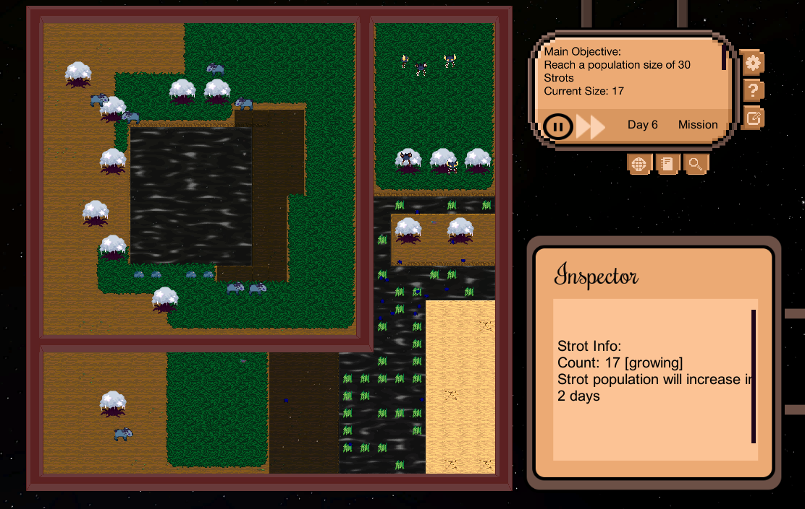

# Space-Zoologist
[California Education Learning Lab Project](https://calearninglab.org/project/e-games-for-active-training-in-engineering-design/)

Space Zoologist is a top down, strategy simulation type video game that strives to teach engineering students the [engineering design process](https://www.teachengineering.org/design/designprocess). It is currently being designed, developed, and playtested and is exptected to be completed by early 2022. In the game, the player takes on the role of a space zoologist that is tasked with restoring the populations of various alien species whose home planet was destroyed. With only partial data on the animals' native environments made available in the encyclopedia, the player will have to research the needs and behaviors of the animals and learn to effectively use their journal in order to develop a solution for each mission. 

## Demo!
[https://louielab.org/SpaceZoologist/](https://louielab.org/SpaceZoologist/)

## Team
We're a team of students from multiple UC schools who are passionate about game development and working part time on this project. We are currently focusing on improving the overall UI/UX and art style, polishing the current gameplay systems and implementing new systems, designing and playtesting more levels, writing narrative and research style articles, and composing music.

